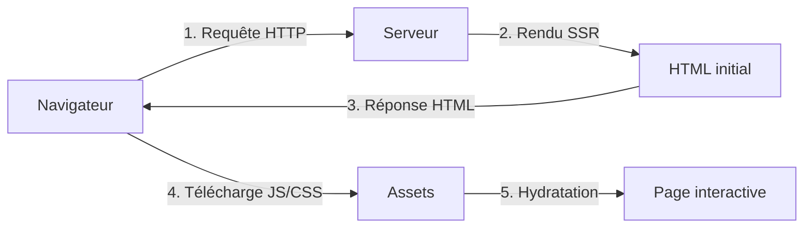
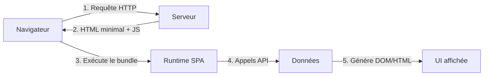
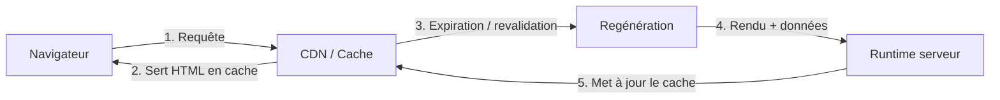

# Rendering web

## Sommaire
- [SSR (Server-Side Rendering)](#ssr-server-side-rendering)
- [CSR (Client-Side Rendering)](#csr-client-side-rendering)
- [SSG (Static Site Generation)](#ssg-static-site-generation)
- [ISR (Incremental Static Regeneration)](#isr-incremental-static-regeneration)
- [Références](#références)

---

## SSR (Server-Side Rendering)

### Définition
Le SSR désigne la pratique consistant à **générer le HTML sur le serveur** puis à **l’envoyer au navigateur**. SSR et CSR ne sont pas exclusifs : une même application peut combiner un rendu serveur initial et une prise de contrôle côté navigateur (hydratation + router).

### Diagramme — chemin de rendu


### Avantages
- **Page minimale fonctionnelle** : le contenu principal peut être visible sans exécution JavaScript, mais sans les interactions.
- **Accessibilité technique** : lecture possible sur des environnements limités (navigateurs anciens, bloqueurs, JS désactivé) tant que l’interactivité n’est pas indispensable.
- **Performance perceptible au chargement initial** : affichage d’un contenu exploitable dès réception du HTML.
- **Compatibilité crawl** : de nombreux robots peuvent analyser le contenu sans dépendre d’un rendu JavaScript complet (même si aujourd'hui la plupart sont capables d'exécuter du JS).

### Impact sur le référencement
- **Indexabilité souvent plus robuste** : le contenu et les liens internes sont présents dans le HTML initial, ce qui facilite exploration et compréhension.
- **Moins de dépendance au rendu JS** : les moteurs capables d’exécuter du JS peuvent indexer du CSR, mais le SSR réduit le risque d’un contenu découvert plus tard ou de manière incomplète.
- **Évite les "workarounds" bot-spécifiques** : la stratégie **dynamic rendering** (= servir un HTML spécial aux bots) est documentée comme un contournement non recommandé.

### SSR sur SvelteKit
- **Comportement par défaut** : rendu serveur initial + hydratation côté client.
- Contrôle par page ou layout :
```js
export const ssr = true;  // autorise le rendu serveur
export const csr = true;  // hydratation
```
- **SSR statique** (sans hydratation par JS) :
```js
export const csr = false; // pas d'hydratation
```

---

## CSR (Client-Side Rendering)

### Définition
Le CSR désigne la pratique consistant à **générer le HTML dans le navigateur** via JavaScript. Le serveur renvoie souvent un HTML minimal ("shell"), puis l’application construit l’interface après chargement/exécution du bundle.

### Diagramme — chemin de rendu


### Avantages
- **Interactivité** : transitions d’écrans et mises à jour d’UI sans rechargement complet (**SPA**).
- **Réactivité après chargement initial** : les interactions peuvent être rapides une fois en **cache**.

### Impact sur le référencement
- **Dépendance au rendu JavaScript** : certains robots, outils de prévisualisation (réseaux sociaux, ...) peuvent ne pas exécuter le JS.
- **Risque de contenu "tardif"** : si le contenu principal (texte, titres, liens) n’existe qu’après exécution JS + appels réseau, l’indexation peut être moins fiable et plus lente.
- **Dynamic rendering non recommandé** : servir une version "SSR pour bots" et "CSR pour humains" est documenté comme un contournement non recommandé.

### CSR sur SvelteKit
- Désactivation du SSR (CSR uniquement) :
```js
export const ssr = false;
```

*Désactiver le SSR implique que toute logique "serveur" doit être déplacée dans un backend séparé (API)*

---

## SSG (Static Site Generation)

### Définition
Le SSG consiste à **générer des pages HTML au build**, puis à les servir en tant que **fichiers statiques**. Aucune logique serveur n’est requise.

### Diagramme — chemin de rendu


### Avantages
- **Performance et coût** : servir du statique est très rapide et peu coûteux.
- **Simplicité opérationnelle** : pas de serveur applicatif requis pour le rendu HTML.

### Impact sur le référencement
- **Généralement excellent** : HTML immédiatement disponible, exploration facilitée.
- **Limite principale : rafraîchissement de contenu**  
  - Pour du contenu fréquemment mis à jour, une stratégie hybride (SSR / ISR) est souvent mise en place.

### Comment le faire via SvelteKit
- Prérendu par route :
```js
export const prerender = true;
```
- Site statique :
  - utiliser `adapter-static`, qui prérend tout le site en fichiers statiques.

---

## ISR (Incremental Static Regeneration)

### Définition
L’ISR est une stratégie hybride : les pages sont servies **comme des pages statiques** (cache/CDN). L’ISR se distingue d'autre rendus parce qu'il se repose sur une logique de cache partagé : le HTML n’est pas généré par requête utilisateur, mais réutilisé jusqu’à revalidation.

### Diagramme — chemin de rendu


### Avantages
- **Compromis performance / fraîcheur** : vitesse du statique + contenu actualisable.
- **Adapté aux gros volumes** : évite un build complet lorsque seules certaines pages doivent évoluer.

### Impact sur le référencement
- **Proche du SSG** : le moteur reçoit du HTML statique (cache), ce qui facilite l’exploration.
- **Attention au contenu personnalisé** : tout contenu qui dépend d'un utilisateur (cookie/session) risque de ne pas être actualisé si la stratégie d'actualisation n'entre pas en vigueur, menant à des incohérences de rendu.

### ISR sur SvelteKit
- SvelteKit ne propose pas d'ISR directement (dépend de la plateforme).

---

## Références
- MDN — SSR (glossaire) : https://developer.mozilla.org/en-US/docs/Glossary/SSR
- MDN — CSR (glossaire) : https://developer.mozilla.org/en-US/docs/Glossary/CSR
- MDN — SSG (glossaire) : https://developer.mozilla.org/en-US/docs/Glossary/SSG
- SvelteKit — Page options (`ssr`, `csr`, `prerender`) : https://svelte.dev/docs/kit/page-options
- SvelteKit — `adapter-static` (SSG) : https://svelte.dev/docs/kit/adapter-static
- SvelteKit — `adapter-node` (serveur Node) : https://svelte.dev/docs/kit/adapter-node
- Google Search Central — Dynamic rendering (workaround non recommandé) : https://developers.google.com/search/docs/crawling-indexing/javascript/dynamic-rendering
- Google Search Central — JavaScript SEO basics : https://developers.google.com/search/docs/crawling-indexing/javascript/javascript-seo-basics