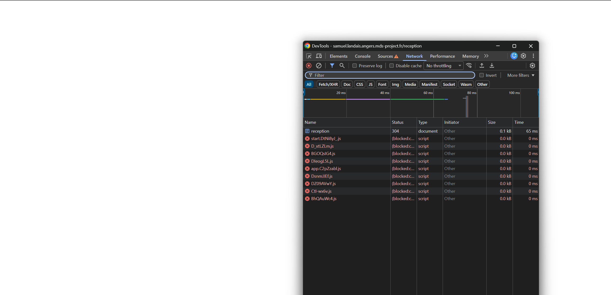
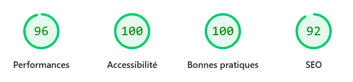
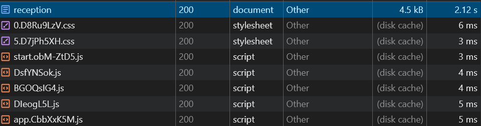
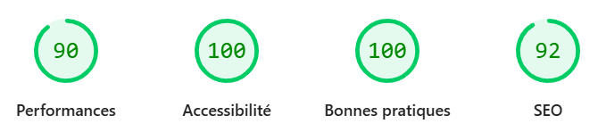
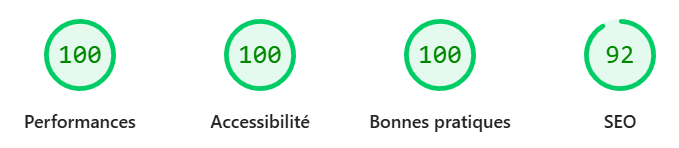

# Tests de rendering – Application SvelteKit

Ce document présente les tests réalisés sur les différents types de rendu
(**CSR, SSR, SSG**) à partir de la page `/reception`, ainsi que leurs impacts
observés sur le référencement à l’aide de Lighthouse.

## Sommaire

- [Contexte de test](#contexte-de-test)
- [CSR — Client-Side Rendering](#csr--client-side-rendering)
- [SSR — Server-Side Rendering](#ssr--server-side-rendering)
- [SSG — Static Site Generation](#ssg--static-site-generation)
- [Conclusion](#conclusion)

---

## Contexte de test

- Framework : SvelteKit
- Page testée : `/reception`
- Méthode : modification des paramètres de rendu
- Objectif : observer le comportement réel du rendu et son impact SEO

---

## CSR — Client-Side Rendering

### Configuration
```ts
export const prerender = false;
export const ssr = false;
export const csr = true;
```

### Observations

- **HTML initial minimal**
  - La réponse `Document` dans l’onglet *Network* contient un HTML très réduit.
- **Dépendance totale au JavaScript**
  - Sans JavaScript, la page reste blanche.
  - Le contenu est généré uniquement après le chargement du bundle JS.

### Captures
- Écran blanc sans JavaScript  
- Chargement du JavaScript responsable du rendu  
  

### Lighthouse


### Impact sur le référencement
- Le contenu principal n’est pas disponible dans le HTML initial.
- L’indexation dépend entièrement de l’exécution JavaScript.
- Ce mode est moins fiable pour le SEO, notamment pour les robots non exécutants JS.
- Les robots restent performants et capables d'exécuter du JavaScript, l'impact reste difficilement mesurable.

---

## SSR — Server-Side Rendering

### Configuration
```ts
export const prerender = false;
export const ssr = true;
export const csr = true;
```

### Observations

- **HTML généré côté serveur**
  - Le document HTML est présent et complet dès la réponse HTTP.
- **Hydratation côté client**
  - Le JavaScript est chargé après le document pour activer l’interactivité.

### Captures
- Chargement du document HTML avant le JavaScript  
  

### Lighthouse


### Impact sur le référencement
- Le contenu est immédiatement accessible dans le HTML initial.
- Les robots peuvent analyser la page sans dépendre du JavaScript.
- Meilleure robustesse SEO par rapport au CSR.

---

## SSG — Static Site Generation

### Configuration
```ts
export const prerender = true;
export const ssr = true;
export const csr = true;
```

### Observations

- **HTML généré au build**
  - Le contenu est figé au moment du build.
  - Une modification du code n’est visible qu’après reconstruction du projet.
- **Comportement identique à SSR côté navigateur**
  - La différence réside dans le moment de génération (build vs requête).

### Lighthouse


### Impact sur le référencement
- HTML immédiatement disponible, comme en SSR.
- Excellentes performances et indexabilité.
- Limitation : le contenu n’est pas mis à jour sans rebuild.

---

## Conclusion

| Mode | HTML initial | Dépendance JS | SEO |
|-----|-------------|---------------|-----|
| CSR | Minimal | Totale | Faible à moyen |
| SSR | Complet | Partielle | Bon |
| SSG | Complet (build) | Partielle | Très bon |

Ces tests montrent que le mode de rendu influence directement
la disponibilité du contenu et la fiabilité de l’indexation.
